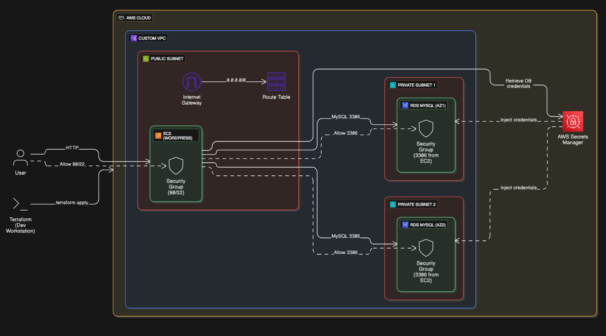

# 🚀 WordPress on AWS using Terraform – Multi-Environment Infrastructure as Code


This project deploys a production-grade WordPress setup on AWS, fully managed using Terraform. It provisions:

- ✅ A WordPress EC2 instance in a public subnet  
- ✅ A MySQL RDS database in private subnets  
- ✅ Secure networking using VPC, subnets, route tables, and security groups  
- ✅ AWS Secrets Manager for secure password storage  
- ✅ Multi-environment support (Dev & Test)

---

## 📁 Project Structure

Terraform-aws-wordpress/  
├── aws_networking/ # VPC, Subnets, IGW, Route Tables  
│ ├── vpc.tf  
│ ├── subnets.tf  
│ ├── internet_gateway.tf  
│ ├── route_table.tf  
│ ├── subnet_routing_table_association.tf    
│ ├── vars.tf  
│ └── output.tf  
├── aws_rds_database/ # MySQL RDS Configuration  
│ ├── data.tf  
│ ├── rds.tf    
│ ├── security_group_rds.tf  
│ ├── rds_subnet_group.tf  
│ ├── vars.tf  
│ └── output.tf  
├── aws_wordpress/ # EC2 WordPress Setup  
│ ├── wordpress_EC2.tf  
│ ├── security_group_wordpress.tf  
│ ├── vars.tf  
│ └── output.tf  
├── main.tf # Root module configuration  
├── provider.tf # AWS provider setup  
├── vars.tf # Global variable definitions  
├── output.tf # Output values  
├── dev.tfvars # Dev environment variables  
├── test.auto.tfvars # Test environment variables  
├── terraform.tfstate* # Terraform state file (ignored)  
├── terraform.lock.hcl* # Provider dependency lock file (ignored)  
└── README.md # This file  

---

## 🧠 Features

- 🔐 **Secure RDS Password**: Stored in AWS Secrets Manager and accessed securely from Terraform.
- 🛡️ **Isolated Network Architecture**: Public EC2 and private RDS with tight security rules.
- 📦 **Modular Structure**: Organized Terraform code with reusable modules.
- 🌍 **Multi-Environment Support**: Easily switch between `dev` and `test` environments using `.tfvars`.

---

## ⚙️ Prerequisites

- ✅ AWS CLI configured (`aws configure`)
- ✅ Terraform installed (v1.5+)
- ✅ AWS Secret created manually in Secrets Manager with the following content:

```bash
{
  "db_username": "admin",
  "db_password": "StrongPass123!"
}
```
ℹ️ The secret must exist before deployment in each region (same name in all regions used).

---
## 🚀 How to Deploy
Replace <env> with either dev or test.

### Clone the Repo

```bash
git clone https://github.com/Gaurav10111/Terraform-AWS-Wordpress-RDS.git
cd Terraform-AWS-Wordpress-RDS

#Initialize Terraform

terraform init
```
### Plan the Infrastructure

```bash
terraform plan -var-file=<env>.tfvars
# Apply the Infrastructure

terraform apply -var-file=<env>.tfvars
```

### Access WordPress

Once deployed, Terraform will output the public IP:

Outputs:
wordpress_public_ip = "XX.XX.XX.XX"  
Open your browser and visit:  
http://XX.XX.XX.XX  

## 🧼 Cleanup
To destroy all resources for an environment:

```bash
terraform destroy -var-file=<env>.tfvars
```
## 📂 .gitignore (Important)
Make sure your .gitignore file includes:

```bash
# Terraform state
*.tfstate
*.tfstate.*
.terraform/

# Secrets / Keys
*.pem
*.key
terraform.tfvars

# Lock files
terraform.lock.hcl
```
---

### 📊 Architecture Overview

<h3 align="center">📊 Infrastructure Architecture Diagram</h3>

<p align="center">
  
</p>

💡 Diagram shows EC2 in public subnet, RDS in private subnets, all inside a custom VPC, with AWS Secrets Manager for MySQL password storage.

---
📬 Contact  
Made with ❤️ by Gaurav Patil  

📧 Email: patil2023gaurav@gmail.com  

🔗 LinkedIn: Gaurav Patil  

🐙 GitHub: @Gaurav10111  
